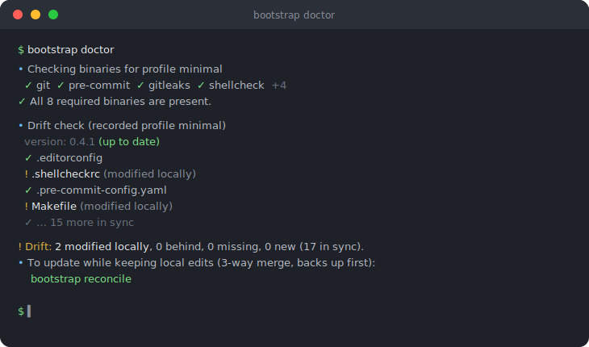

# bootstrap-web-setup

[](https://github.com/Labault/bootstrap-web-setup/actions/workflows/ci.yml)
[](https://github.com/Labault/bootstrap-web-setup/actions/workflows/tests.yml)
[](https://github.com/Labault/bootstrap-web-setup/actions/workflows/acceptance.yml)
[](https://github.com/Labault/bootstrap-web-setup/actions/workflows/security.yml)
[](https://github.com/Labault/bootstrap-web-setup/actions/workflows/reference.yml)
[](LICENSE)

Drop a standardized quality / CI / security configuration layer into any web
project with **one command**, then keep it in sync through a small CLI called
`bootstrap`.

> **New here? Read this file once, top to bottom.** It explains what bootstrap
> deposits, how to install it, and which commands you can run afterward.

## Who this is for

Web developers (primarily PHP/Symfony, optionally with a JS/TS front) who want
the **same quality baseline in every project** (pre-commit hooks, static
analysis, CI workflows, secret scanning, Dependabot…) without copy-pasting config
files from one repo to the next and letting them drift apart.

It is the **project-level companion** to
[mac-dev-setup](https://github.com/Labault/mac-dev-setup), and its logical
continuation one level down: mac-setup tools your **machine** (installs the
binaries), bootstrap tools your **project** (deposits the config those binaries
read). Same author, same conventions: the two are maintained together and
evolve in lock-step.

## How it works at a glance

`install.sh` sets up a small `bootstrap` CLI. Its core principle is
**non-negotiable: bootstrap writes config files only. It never installs
binaries.** The tools that read those files come from your machine.

- `bootstrap apply` deposits a profile's config into your project and records a
  `.bootstrap.yaml` (profile, version, files + hashes).
- `bootstrap doctor` checks required binaries and reports configuration drift.
- `bootstrap reconcile` 3-way-merges template updates while keeping your local edits.
- Anything overwritten is backed up first; every mutating command has `--dry-run`.


## Quick start (30 seconds)

```sh
git clone https://github.com/Labault/bootstrap-web-setup.git
cd bootstrap-web-setup && ./install.sh

cd /path/to/your/project
bootstrap apply            # auto-detects the profile; add --profile to force one
```

This is the fastest path. Keep reading for profiles, deposited files, backups,
and the full command reference.


## Table of contents

- [Who this is for](#who-this-is-for)
- [How it works at a glance](#how-it-works-at-a-glance)
- [Quick start (30 seconds)](#quick-start-30-seconds)
- [What's included](#whats-included)
- [Installation](#installation)
- [Make it yours](#make-it-yours)
- [The `bootstrap` CLI: command reference](#the-bootstrap-cli-command-reference)
- [Going further](#going-further)
- [License](#license)

---

## What's included

### Profiles

The profile decides **which files are deposited** and **which binaries are
required**. Profiles inherit from each other.

| Profile | For | Adds on top of its parent |
| --- | --- | --- |
| `minimal` | Any web repo (language-agnostic) | pre-commit, EditorConfig, commit-msg lint, gitleaks, shellcheck, markdownlint, actionlint, lychee, base CI/security workflows, Dependabot, transverse files |
| `symfony` | PHP/Symfony | PHPStan, PHP-CS-Fixer, Rector, hadolint, PHP CI, PHP `make` targets |
| `shell` | Shell/Bash tooling repos | bats, shfmt, `tests.yml` CI, shell `make` targets (on top of the inherited shellcheck) |
| `fullstack` | Symfony + JS/TS front | ESLint, Prettier, Husky + lint-staged, front CI |


### Linting & formatting

EditorConfig, a local-mode `.pre-commit-config.yaml` (editorconfig-checker,
gitleaks, shellcheck, markdownlint, actionlint, commit-msg lint), and (per profile)
PHP-CS-Fixer (`@Symfony`), PHPStan (level 9 + auto baseline), Rector, ESLint and
Prettier (`symfony` / `fullstack`), and `shfmt` (`shell`).

### CI & security

GitHub Actions workflows (`ci.yml` lint + links, `security.yml` gitleaks +
dependency review, plus per-profile CI: `php.yml` (`symfony`), front CI
(`fullstack`) and `tests.yml` running `bats tests/` (`shell`)), a
`.gitleaks.toml` secret-scanning config, and a `.github/dependabot.yml`.

### Docs, hooks & transverse files

`Makefile` (`make qa / lint / fix / hooks`), `SECURITY.md`, `CONTRIBUTING.md`,
`CLAUDE.md`, pull-request and issue templates, a merged `.gitignore` and
`.vscode/extensions.json`, and the `.bootstrap.yaml` state file.

See the per-profile pages in [`docs/profiles/`](docs/profiles/) for the exact
file lists.

## Installation

### Prerequisites

- **bash 4+** (`brew install bash`, macOS ships 3.2)
- **git** and **jq** (used by `apply` / `reconcile`)
- The tools each profile needs on your machine: run `bootstrap doctor` to see
  which are missing (they come from mac-setup, not from bootstrap)

### Step 1: Install the CLI

```sh
git clone https://github.com/Labault/bootstrap-web-setup.git
cd bootstrap-web-setup
./install.sh            # symlinks `bootstrap` into ~/.local/bin (override with BOOTSTRAP_BIN_DIR)
```

Make sure the target directory is on your `PATH`, then check it works:

```sh
bootstrap --version
bootstrap --help
```

### Step 2: Apply a profile to a project

```sh
cd /path/to/your/project
bootstrap doctor          # check the required binaries first
bootstrap apply --dry-run # preview, write nothing
bootstrap apply           # deposit the config + write .bootstrap.yaml + install hooks
```

### Choosing a profile

Auto-detection: `composer.json` → `symfony`; `+ package.json` → `fullstack`;
tracked `*.sh`/`*.bash` with no such manifest → `shell`; otherwise `minimal`.
Override anytime with `--profile`:

```sh
bootstrap apply --profile symfony
```

### Files bootstrap deposits

On an existing project, absent files are written, identical files are a no-op,
`.gitignore` and `.vscode/extensions.json` are **merged**, and other existing
files are **backed up then replaced** (or skipped with `--no-overwrite`). Each
`apply` records a `.bootstrap.yaml`, the trace that powers drift detection and
reconcile.

### Backups & rollback

Anything overwritten is copied first to
`~/Documents/Backups/bootstrap/<project>/<timestamp>/`, so a rollback is always a
manual copy away. bootstrap also **never edits** `composer.json` / `package.json`.
It only prints the `composer require --dev` / `npm install -D` lines to run.

## Make it yours

bootstrap is a fork-friendly, data-driven tool: the profiles live in
[`profiles/`](profiles/) (declarative YAML manifests) and the files they deposit
live in [`templates/`](templates/). To adjust the baseline, edit a template or a
manifest and re-`apply`. The repo eats its own dog food. It self-applies the
`shell` profile (it's a Bash tooling repo with a bats suite) and its CI runs the
very pipeline it ships.

## The `bootstrap` CLI: command reference

Every command supports `--help`:

```sh
bootstrap <command> --help
```

### All commands

| Command | What it does |
| --- | --- |
| `bootstrap apply` | Deposit the profile's config into the target project |
| `bootstrap doctor` | Check required binaries and report config drift |
| `bootstrap reconcile` | 3-way-merge a project with the current templates (keeps local edits) |
| `bootstrap update` | Update bootstrap itself (never touches projects) |
| `bootstrap list` | List available profiles and their contents |
| `bootstrap detect` | Print the profile that would be used for a directory |

---

### `bootstrap apply`

Deposit the (detected or given) profile's config into a project.

```sh
bootstrap apply                       # auto-detected profile, current directory
bootstrap apply --profile symfony
bootstrap apply --dry-run             # preview, change nothing
bootstrap apply --no-overwrite        # never overwrite an existing, differing file
bootstrap apply --skip-bin-check      # don't block on missing binaries (CI / deferred install)
```

---

### `bootstrap doctor`

Check that the binaries required by the profile are installed and, once a project
has a `.bootstrap.yaml`, report how its config has drifted from the current
templates. Drift is informational by default.

```sh
bootstrap doctor                # binaries + drift report
bootstrap doctor --strict       # exit non-zero if drift is detected (for CI)
bootstrap doctor --skip-bin-check
```

---

### `bootstrap reconcile`

Bring a project up to date with the current templates **while keeping local
edits**, via a real 3-way merge (the base is the template at the commit recorded
in `.bootstrap.yaml`). Files are backed up first; conflicts are written with
markers to resolve by hand.

```sh
bootstrap reconcile --dry-run   # preview merges / conflicts
bootstrap reconcile             # merge; resolve any conflicts, then commit
```

---

### `bootstrap update`

Update bootstrap itself (`git pull --ff-only` in its own checkout). **It never
touches your projects.**

```sh
bootstrap update --dry-run      # report whether an update is available
bootstrap update
```

---

### `bootstrap list`

List the available profiles, their inheritance, required binaries, and the files
they deposit.

```sh
bootstrap list
```

## Going further

bootstrap is **one-shot but evolutive**: `apply` records what it deposited, so it
can later detect drift and merge template updates without forgetting your edits.




- Per-profile file lists: [`docs/profiles/`](docs/profiles/):
  [minimal](docs/profiles/minimal.md) ·
  [symfony](docs/profiles/symfony.md) ·
  [shell](docs/profiles/shell.md) ·
  [fullstack](docs/profiles/fullstack.md)
- How the CLI is built: [`docs/architecture.md`](docs/architecture.md)
- The full design spec (all locked decisions):
  [`docs/cahier-des-charges-bootstrap.md`](docs/cahier-des-charges-bootstrap.md)
- **Drift detection & reconcile**: see the `doctor` and `reconcile` commands
  above; this is the one-shot-evolutive lifecycle (apply records state → doctor
  signals drift → reconcile merges).
- **Tests**: a [bats](https://github.com/bats-core/bats-core) unit suite
  (`bats tests/`, the `Tests` workflow) and a black-box
  [acceptance harness](validation/README.md) (`cd validation && ./run-all.sh`,
  the `Acceptance` workflow), both run in CI.
- **Proof on real projects**: the `Reference` workflow applies a profile to a
  matching example and runs the deposited gates to prove the pipeline stays green:
  the `symfony` profile on [`examples/symfony-reference/`](examples/symfony-reference/)
  (php-cs-fixer / phpstan / rector / phpunit) and the `shell` profile on
  [`examples/shell-reference/`](examples/shell-reference/) (shellcheck / shfmt / bats).

## License

bootstrap-web-setup is released under the MIT License. See [`LICENSE`](LICENSE)
for details.
